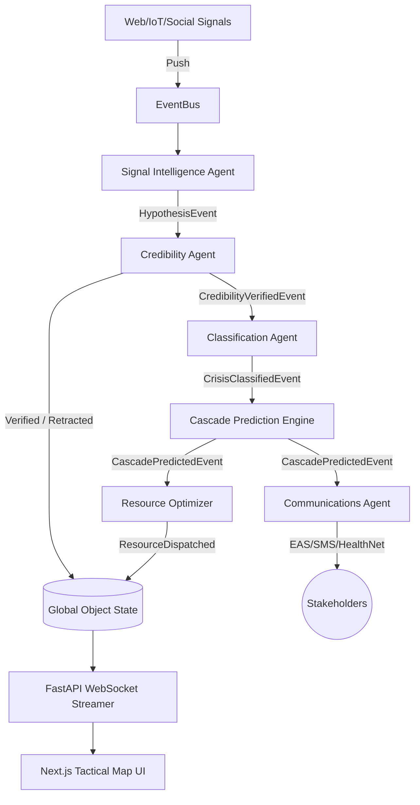

# Autonomous Urban Crisis Intelligence System

## 1. System Integration Overview

The Autonomous Urban Crisis Intelligence platform is an entirely decentralized multi-agent system governed by an asynchronous, prioritizing `EventBus`. It fuses raw, noisy anomaly signals into modeled cascade failures and automatically plots real-time operational mitigation matrices across a simulated smart city.

All modules engineered during the five phases are now firmly integrated into the single orchestrator loop:
1. **Intelligence Funnel:** Fuses Open Data & IoT (`SignalIntelligenceAgent`).
2. **Global State Model:** The centralized Pydantic-validated representation of the city. Provides thread-safe snapshotting to agents.
3. **Adaptive Verification:** Uses contradiction analysis and confidence decay to dynamically upgrade or fully retract alerts on-the-fly (`VerificationEngine` & `CredibilityAgent`).
4. **Cascade Prediction:** A graph-based consequence propagation calculation (`CascadePredictionEngine`).
5. **Resource Optimization:** Computes multi-variant travel delays and coordinates simultaneous dispatch allocations while preserving failure margins (`ResourceOptimizationEngine`).
6. **Stakeholder Communication:** Molds severity data into dynamic routing templates (`StakeholderMessagingEngine`).

## 2. Orchestration Flow & Realtime Synchronization

## 3. Communication Integration
To push state to the client, the `StateManager` natively interfaces with `api.main` (FastAPI). The integration runs on continuous 1.0s clock ticks handled by `SimulationClock`. Inside the `app.on_event("startup")` loop, we explicitly wire the multi-agent `trace_logger.log_trace` method into a `asyncio.create_task` broadcast overlay.
This allows every agent's internal reasoning matrix (Confidence calculation, Contradiction Flags) to automatically serialize into JSON, pump through the single unblocking WebSocket, and render natively in the Next.js dark-tactical dashboard simultaneously alongside physical map location movements.

## 4. Resilience & Scalability Notes
- **Event Dropping Prevention:** Instead of direct HTTP calls between agents (which fail and cause 502s), all components communicate strictly via `asyncio.PriorityQueue` on the `EventBus`.
- **Degraded Mode Handling:** The `ResourceOptimizationEngine` actively prevents system collapse by locking at least a 20% global component baseline dynamically. If sensors fail, the `VerificationEngine` automatically applies Confidence Decay rules after 10 simulation minutes.
- **Microservice Ready:** Though currently operating inside a unified Python Event Loop for simulation brevity, the architecture allows dropping Kafka/RabbitMQ under the `EventBus` and launching each Agent inside standalone Docker containers for planetary scale.