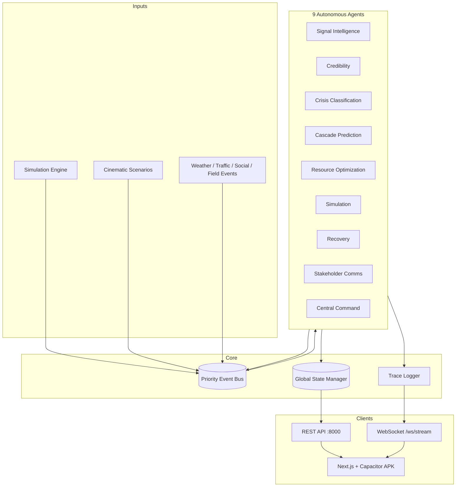

<p align="center">
  
</p>

<h1 align="center">Crisis OS</h1>
<p align="center">
  <strong>Autonomous Urban Crisis Intelligence Platform</strong><br/>
  Nine AI agents. One living city. Real-time command on your phone.
</p>

<p align="center">
  
  
  
  
  
</p>

<p align="center">
  <a href="#-what-it-does">Features</a> ·
  <a href="#-interface">Interface</a> ·
  <a href="#-architecture">Architecture</a> ·
  <a href="#-quick-start">Quick Start</a> ·
  <a href="#-api-surface">API</a> ·
  <a href="docs/DOCUMENTATION.md">Full Documentation</a> ·
  <a href="docs/Crisis_OS_Documentation.pdf">PDF</a>
</p>

---

## The problem

Cities drown in **noisy, contradictory signals** during a crisis — social posts, weather feeds, traffic spikes, field reports. Human operators cannot fuse, verify, predict cascades, and dispatch resources fast enough.

## The answer

**Crisis OS** simulates a smart-city command stack where **nine specialized agents** collaborate on a shared event bus: detect anomalies, verify credibility, classify incidents, predict second-order failures, optimize dispatch, and draft stakeholder communications — all streamed live to a **mobile-first tactical UI** (and a native Android APK).

> Not a chatbot wrapper. A full **multi-agent orchestration system** with global state, simulation clock, cinematic scenarios, and explainable agent traces.

---

## What it does

| Capability | How Crisis OS delivers it |
|------------|---------------------------|
| **Signal fusion** | Clusters social, weather, traffic & field data into incident hypotheses |
| **Credibility & contradictions** | Retracts false positives, merges duplicates, escalates ambiguous cases |
| **Cascade prediction** | Graph-based forecasts (traffic collapse, hospital surge, evacuation spirals) |
| **Resource optimization** | Dispatches ambulances/fire with ETA penalties and a **20% hard reserve** |
| **Stakeholder comms** | Auto-generated briefs for EAS/SMS-style messaging channels |
| **Live transparency** | Every agent decision streams to Terminal & Operations tabs via WebSocket |
| **Optional Gemini reasoning** | Google Gemini 2.0 Flash enriches signal-intelligence narratives when configured |
| **Demo-ready scenarios** | One-tap cinematic crises for presentations (misinformation, exhaustion, hazmat, etc.) |

---

## Interface

Mobile **Crisis OS** — dark tactical aesthetic, cyan accent (`#4fd1c5`), five workspaces:

<table>
<tr>
<td width="50%">

### Map
Live Leaflet tactical map — incidents, resources, district stress.

<p align="center"></p>

</td>
<td width="50%">

### Signals
Incident feed + scenario triggers (simultaneous crises, contradictions, evacuation, exhaustion).

<p align="center"></p>

</td>
</tr>
<tr>
<td width="50%">

### Resources
Hospital load bars, unit status, dispatch ETAs.

<p align="center"></p>

</td>
<td width="50%">

### Terminal & Actions
Agent reasoning stream + operational outcome cards (final decisions).

<p align="center"></p>

</td>
</tr>
</table>

**Neural Link** config screen connects the app to your laptop backend (`192.168.x.x:8000`). Skip mode opens the UI offline with clear warnings when the brain is disconnected.

---

## Architecture



**Design principles**

- **Event-driven, not point-to-point HTTP** between agents — avoids coupling and 502 chains
- **Thread-safe global state** with snapshots & timeline rollback support
- **Priority queue** on the bus (CRITICAL → LOW)
- **Degraded-mode safety** — reserve floor on resources; confidence decay on stale signals
- **Microservice-ready** — swap the in-process bus for Kafka/RabbitMQ and containerize each agent

Deep dive: [`docs/DOCUMENTATION.md`](docs/DOCUMENTATION.md) · PDF: [`docs/Crisis_OS_Documentation.pdf`](docs/Crisis_OS_Documentation.pdf)

---

## Agent pipeline

```
Raw signals → Signal Intelligence → Credibility → Classification
    → Cascade Prediction → Resource Optimization + Communications
    → Recovery + Central Command (state confirmation)
```

| Agent | Role |
|-------|------|
| **SignalIntelligenceAgent** | Buffers & clusters signals (≥3 per location); emits hypotheses; optional Gemini reasoning |
| **CredibilityAgent** | Verification engine: retract, merge, escalate human, or verify |
| **CrisisClassificationAgent** | Incident lifecycle in global state; emits `CrisisClassifiedEvent` |
| **CascadePredictionAgent** | Second-order effect graph → `CascadePredictedEvent` |
| **ResourceOptimizationAgent** | Allocation, ETA penalties, dispatch events |
| **SimulationAgent** | Placeholder for future sim hooks |
| **RecoveryAgent** | Tracks mitigation after dispatch |
| **StakeholderCommunicationAgent** | Briefs for public / health / emergency channels |
| **CentralCommandAgent** | Command overlay & playbook activation |

Supporting engines (non-agent): `VerificationEngine`, `ResourceOptimizationEngine`, `StakeholderMessagingEngine`, `CascadePredictionEngine`, `IntelligenceEngine` (Gemini).

---

## Tech stack

| Layer | Technologies |
|-------|----------------|
| **Backend** | Python, FastAPI, Uvicorn, Pydantic v2 |
| **Orchestration** | `asyncio` priority event bus, 9 agent classes |
| **AI** | `google-generativeai` (Gemini 2.0 Flash), heuristic fallback |
| **Frontend** | Next.js 14 (static export), React 18, Tailwind, Framer Motion |
| **Map** | Leaflet + react-leaflet (Carto dark tiles) |
| **Mobile** | Capacitor 8 → Android APK |
| **Realtime** | WebSocket + 1s REST polling |

---

## Quick start

### 1. Backend (AI brain)

```bash
cd AI_SEKHOO
pip install -r requirements.txt

# Optional — enable Gemini reasoning
# Create .env with: GOOGLE_API_KEY=your_key_here

python main.py
```

Server: **http://0.0.0.0:8000**  
Legacy embedded dashboard: **http://localhost:8000/**

### 2. Frontend (dev)

```bash
cd frontend
npm install
npm run dev
```

Open **http://localhost:3000** → enter your PC LAN IP, e.g. `192.168.100.120:8000`.

### 3. Android APK

```bash
cd frontend
npm run build
npx cap sync android
# Open frontend/android in Android Studio → Build APK
```

Phone and PC must share Wi‑Fi. Backend must bind to `0.0.0.0`, not `127.0.0.1` only.

---

## API surface

| Method | Endpoint | Purpose |
|--------|----------|---------|
| `GET` | `/api/system/status` | Health check (mobile config) |
| `GET` | `/state` | Full city snapshot |
| `GET` | `/state/incidents` · `/state/resources` · `/state/timeline` | Partial state |
| `GET` | `/traces` | Agent reasoning log |
| `GET` | `/operations` | Operational outcomes only |
| `GET` | `/config/ai` | Gemini enabled status |
| `POST` | `/simulation/scenarios/*` | Cinematic demo scenarios |
| `POST` | `/simulation/clock/pause` · `resume` · `speed` | Time control |
| `WS` | `/ws/stream` | `clock_tick`, `trace`, `operation` events |

Full reference with payloads: [`docs/DOCUMENTATION.md#5-rest-api-reference`](docs/DOCUMENTATION.md#5-rest-api-reference)

---

## Demo scenarios

Perfect for live presentations — see [`DEMO.md`](DEMO.md):

| Trigger | Story |
|---------|--------|
| **Simultaneous crises** | Heatwave + flood while the system stays stable |
| **Contradictory reports** | 12 false Uptown “explosion” signals → credibility retract |
| **Evacuation spiral** | Hazmat → cascade traffic collapse → reroute reserves |
| **Resource exhaustion** | Four incidents + M6.2 earthquake → 20% reserve lock |

From the app: **Signals** tab scenario buttons, or **Diagnostics** sheet (Matrix tap on status bar).

---

## Project structure

```
AI_SEKHOO/
├── main.py                 # Uvicorn entry
├── src/
│   ├── api/                # FastAPI, WebSocket, CORS
│   ├── agents/             # 9 agents + narrative + cascade
│   ├── orchestration/      # Event bus, events, orchestrator
│   ├── state/              # Pydantic models + StateManager
│   ├── simulation/         # Clock, city engine, scenarios
│   ├── verification/       # Credibility engine
│   ├── optimization/       # Dispatch engine
│   ├── communication/      # Stakeholder templates
│   ├── intelligence/       # Gemini wrapper
│   └── traces/             # Trace / outcome logger
├── frontend/
│   ├── app/                # Next.js pages
│   ├── components/         # Mobile UI + views
│   ├── hooks/              # useCrisisBackend
│   ├── lib/                # api.ts, types, constants
│   └── android/            # Capacitor (after cap sync)
├── docs/
│   ├── DOCUMENTATION.md    # Full technical doc
│   ├── Crisis_OS_Documentation.pdf
│   └── images/             # UI screenshots
├── ARCHITECTURE.md         # Integration overview
└── DEMO.md                 # Presentation script
```

---

## Environment

| Variable | Purpose |
|----------|---------|
| `GOOGLE_API_KEY` | Enables Gemini in Signal Intelligence (`GET /config/ai` shows status) |

Without a key, the system runs on **deterministic heuristics** — fully functional for demos.

---

## Documentation

| Resource | Description |
|----------|-------------|
| [**DOCUMENTATION.md**](docs/DOCUMENTATION.md) | Architecture, agents, APIs, integration, deployment |
| [**Crisis_OS_Documentation.pdf**](docs/Crisis_OS_Documentation.pdf) | Printable / shareable PDF export |
| [**ARCHITECTURE.md**](ARCHITECTURE.md) | Integration & resilience notes |
| [**DEMO.md**](DEMO.md) | Cinematic demo script for judges & audiences |

---

## Why this project stands out

- **End-to-end system** — backend orchestration, simulation, APIs, mobile UI, and APK — not a single-model demo
- **Explainability by design** — traces and operational outcomes are first-class, not afterthoughts
- **Resilience behaviors** — false-positive retraction, reserve floors, human escalation
- **Production-minded patterns** — CORS, health checks, offline mode, mixed-content fixes for Android LAN dev
- **Presentation-ready** — scenarios engineered for narrative impact

---

<p align="center">
  <sub>Built for autonomous urban crisis intelligence — fuse the noise, command the city.</sub>
</p>
